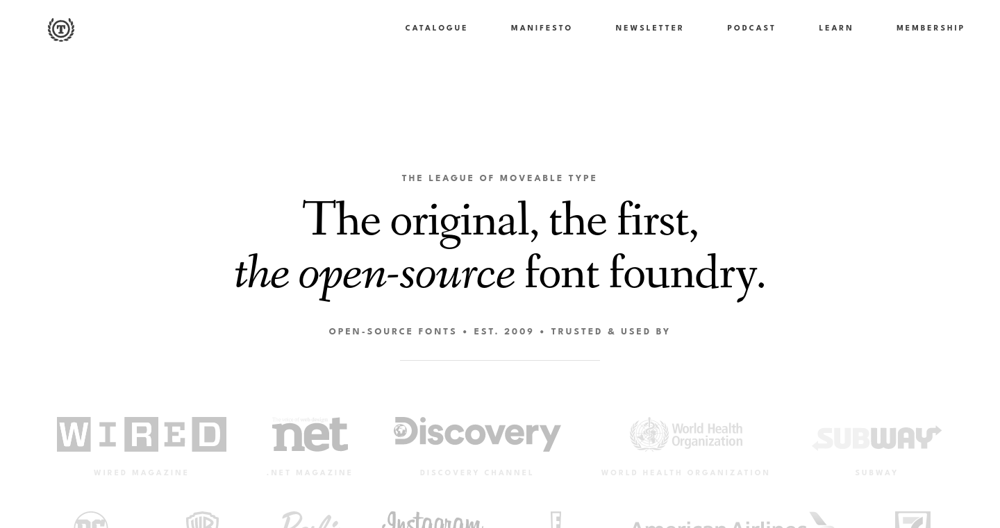
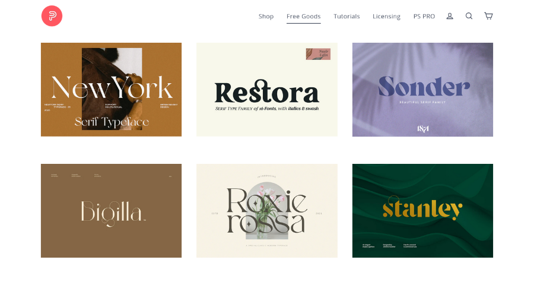
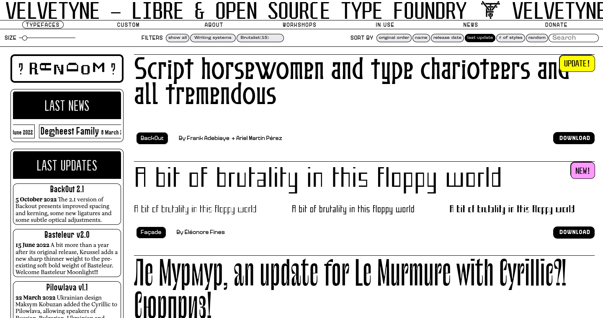
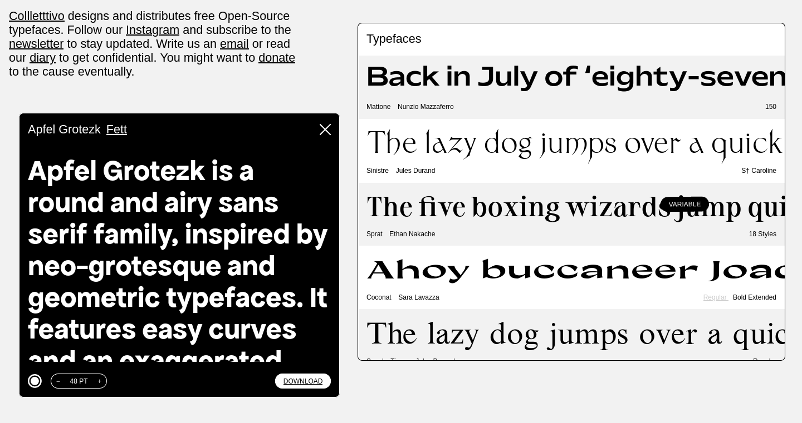

Creating zines has taught me the importance of fonts.
Unfortunately it's also taught me how hard it can be to find the right one.
Popular sites often have a decent range, but I found there was often too much on offer.

I prefer sites with a focused selection, and prices which are suitable for a hobby.
They didn't have to be free, but anything over $50 was probably going to be too much for the scope of my projects.

With a bit of searching, these were the sites I've ended up liking the most.

## <a target="_blank" href="https://typodermicfonts.com/">Typodermic Fonts</a> ([free](https://typodermicfonts.com/some-free/) and paid)

If I'm looking for an interesting font, this will be the first place I look.
Each one has a write up explaining it's style and inspiration.
It's a great way of knowing if it will fit with my intended purpose.

Though there is a bit too much to choose from, their search works fine if you have an idea of what you are after.
I've looked at prices extensively, but most of the their paid fonts seem to be around $30 USD.

## <a target="_blank" href="https://www.theleagueofmoveabletype.com/">The League of Moveable Type</a> (free and open source)

Free and open source.
This is probably one of the better options out there.
A small set of high quality fonts.
Similar to Typodermic Fonts, they've got a description and background for each.
Love it.

## <a target="_blank" href="https://pixelsurplus.com/">Pixel Surplus</a> ([free](https://pixelsurplus.com/collections/free-fonts) and [paid](https://pixelsurplus.com/collections/fonts))

A great site, but a bit sneaky.
They have a free section which unfortunately is a mix of "free for commercial use" and "free for personal use" rather than just being one or the other.
Paid fonts are on the lower end at about the $18 USD mark though.
Their selection is quite large, but you can filter by "Best Selling" as an easy way to see what their popular offerings are.

## <a target="_blank" href="https://www.velvetyne.fr/">Velvetyne</a> (free and open source)

A decent range with some interesting suggested filter options such as Brutalist, Fantasy, and Grotesque.
Each font has some background, and examples of it being used in the wild.

## <a target="_blank" href="http://collletttivo.it/">Collletttivo</a> (free and open source)

A small selection of open source fonts.
If you are looking to find a clean, simple font then it will be worth checking them out.

## Conclusion

Hopefully you've been able to find what you are looking for.
As I've been researching these sites a bit deeper, it's certainly inspired me to try new projects and new styles. 
Forever falling down the rabbit hole.
