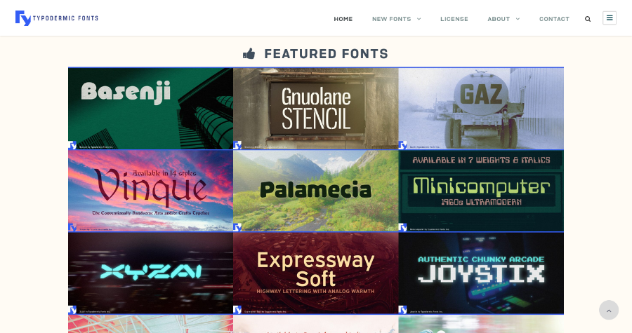

Creating a few Zines has taught me the importance of fonts.
It's also taught me that it can be quite hard to find useful font sites via a search engine.
Often the top sites will have an overwhelming amount of options, minimal quality control, or they are prohibitively expensive.

I was looking for sites with a smaller, more curated selection.
Though I wasn't looking to get everything for free, being on the cheaper end would be a bonus.
At the end of the day, I'm doing this for a hobby.

Here is a collection of websites that I've find useful in my search for the perfect typeface.

## [Typodermic Fonts](https://typodermicfonts.com/) ([free](https://typodermicfonts.com/some-free/) and paid)

One of the favourites.
Each of their fonts has a write up explaining it's style and inspiration.
I find that it's a great help when I want to know the font is going to work for the purpose I have in mind. 

Though there is a bit too much to choose from, their search works fine if you have an idea of what you are after.
I've not searched through extensively, but most of the their paid fonts are around $30 USD.

## [The League of Moveable Type](https://www.theleagueofmoveabletype.com/) (free and open source)

Free and open source.
This is probably one of the better options out there.
A small set of high quality fonts.
Similar to Typodermic Fonts, they've got descriptions and background for each of the their fonts.
Love it.

## [Pixel Surplus](https://pixelsurplus.com/) ([free](https://pixelsurplus.com/collections/free-fonts) and [paid](https://pixelsurplus.com/collections/fonts))

A great site, but a bit sneaky.
They have a free section which unfortunately is a mix of "free for commercial use" and "free for personal use" rather than just being one or the other.
In saying that, fonts that are paid are generally only around the $18 USD mark.
Their selection is quite large, but you can filter by "Best Selling" as an easy way to see what their popular offerings are.

## [Velvetyne](https://www.velvetyne.fr/fonts/backout/) (free and open source)

A decent range with some interesting suggested filter options such as Brutalist, Fantasy, and Grotesque.
Each font has some background, and examples of it being used in the wild.

## [Collletttivo](http://collletttivo.it/) (free and open source)

A small selection of open source fonts.
If you are looking to find a clean, simple font then it will be worth checking them out.

## Conclusion

Hopefully you've been able to find what you are looking for.
As I've been researching these sites a bit deeper, I've been inspired to make more photography zines.
Forever falling down the rabbit hole.
